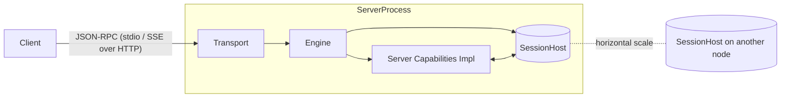

<div align="center">

# mcp-server-go

<strong>Build Model Context Protocol servers that scale from a 20‑line stdio prototype to a horizontally scaled, OIDC‑protected streaming HTTP deployment — without rewriting business logic.</strong>

<p>
	<a href="https://pkg.go.dev/github.com/ggoodman/mcp-server-go"></a>
	<a href="https://goreportcard.com/report/github.com/ggoodman/mcp-server-go"></a>
	<a href="LICENSE"></a>
	<a href="https://github.com/ggoodman/mcp-server-go/actions/workflows/ci-test.yml"></a>
</p>

</div>

---

## Install / Import

Go module: `github.com/ggoodman/mcp-server-go`

Add to your project:

```bash
go get github.com/ggoodman/mcp-server-go@latest
```

Browse documentation: https://pkg.go.dev/github.com/ggoodman/mcp-server-go

Minimum Go version: as declared in `go.mod` (currently 1.24). The module follows standard Go module semantic import versioning (no v2 path yet).

---

## TL;DR Quickstart (stdio CLI)

Below is a tiny CLI MCP server exposing a single structured tool that reverses user input and emits both plain text and structured output. Run it under any MCP client that speaks stdio.

```go
package main

import (
	"context"
	"log"
	"os"

	"github.com/ggoodman/mcp-server-go/mcp"
	"github.com/ggoodman/mcp-server-go/mcpservice"
	"github.com/ggoodman/mcp-server-go/stdio"
)

type ReverseArgs struct {
	Text string `json:"text"`
}

type ReverseOut struct {
	Reversed string `json:"reversed"`
	Length   int    `json:"length"`
}

func main() {
	// Define a typed tool in one go (input + output schemas are reflected).
	reverseTool := mcpservice.NewToolWithOutput[ReverseArgs, ReverseOut](
		"reverse", // tool name
		func(ctx context.Context, _ mcpservice.ToolResponseWriterTyped[ReverseOut], w mcpservice.ToolResponseWriterTyped[ReverseOut], r *mcpservice.ToolRequest[ReverseArgs]) error {
			in := r.Args().Text
			rs := []rune(in)
			for i, j := 0, len(rs)-1; i < j; i, j = i+1, j-1 {
				rs[i], rs[j] = rs[j], rs[i]
			}
			out := string(rs)
			_ = w.AppendText("reversed: " + out) // plain content block
			w.SetStructured(ReverseOut{Reversed: out, Length: len(rs)})
			return nil
		},
		mcpservice.WithToolDescription("Reverse a string (demo)"),
	)

	tools := mcpservice.NewToolsContainer(reverseTool)

	server := mcpservice.NewServer(
		mcpservice.WithServerInfo(mcp.ImplementationInfo{Name: "reverse-cli", Version: "0.0.1"}),
		mcpservice.WithToolsCapability(tools),
	)

	// Stdio handler spins up an in‑memory SessionHost automatically.
	h := stdio.NewHandler(server)
	if err := h.Serve(context.Background()); err != nil {
		log.Println("server exited:", err)
		os.Exit(1)
	}
}
```

Upgrade path: swap the transport + host; your `server` stays the same.

```go
// (Sketch – not a full program)
host := redishost.New(redisClient) // or your implementation of sessions.SessionHost
authn, _ := auth.NewFromDiscovery(ctx, issuerURL, auth.WithExpectedAudience(publicURL))
httpHandler, _ := streaminghttp.New(ctx, publicURL, host, server, authn,
	streaminghttp.WithAuthorizationServerDiscovery(issuerURL),
	streaminghttp.WithServerName("reverse-prod"),
)
http.Handle("/mcp", httpHandler)
```

---

## Capability Model (Server Side)

At initialization the client sends its `ClientCapabilities`; the server responds with `ServerCapabilities`. Each negotiated capability unlocks a method set (see `mcp/messages.go`). Server implementations choose between:

1. **Containers (static sets)** – simple, mutation helpers, built‑in pagination and change notifications.
2. **Callbacks / Providers (dynamic)** – per session logic via option providers (`WithToolsProvider`, etc.).

### Summary Table

| Domain | Methods (list/read/call) | Change Notifications | Container Helper | Dynamic Hook |
|--------|--------------------------|----------------------|------------------|--------------|
| Tools | `tools/list`, `tools/call` | `notifications/tools/list_changed` | `NewToolsContainer` + `NewTool*` | `WithToolsProvider` |
| Resources | `resources/list`, `resources/read`, templates | `notifications/resources/list_changed`, `notifications/resources/updated` | `NewResourcesContainer` | `WithResourcesProvider` |
| Prompts | `prompts/list`, `prompts/get` | `notifications/prompts/list_changed` | (inline: build your own) | `WithPromptsProvider` |
| Logging | `logging/setLevel` | `notifications/message` | (implement interface) | `WithLoggingProvider` |
| Completions | `completion/complete` | — | (implement interface) | `WithCompletionsProvider` |
| Sampling | `sampling/createMessage` | — | (implement using `mcp/sampling` helpers) | — |
| Elicitation | `elicitation/create` | — | Use `elicitation.Builder` | — |
| Roots | `roots/list` | `notifications/roots/list_changed` | (implement interface) | (future) |

### Tools via Container

```go
tools := mcpservice.NewToolsContainer(
	mcpservice.NewTool[MyArgs]("do_stuff", func(ctx context.Context, s sessions.Session, w mcpservice.ToolResponseWriter, r *mcpservice.ToolRequest[MyArgs]) error {
		_ = w.AppendText("done")
		return nil
	}, mcpservice.WithToolDescription("Does stuff")),
)
server := mcpservice.NewServer(mcpservice.WithToolsCapability(tools))
```

### Tools Dynamically (Per Session)

```go
server := mcpservice.NewServer(
	mcpservice.WithToolsProvider(func(ctx context.Context, sess sessions.Session) (mcpservice.ToolsCapability, bool, error) {
		if sess.UserID() == "restricted" { return nil, false, nil }
		tc := mcpservice.NewToolsContainer(/* build based on session */)
		return tc, true, nil
	}),
)
```

---

## Session-Level Capabilities (Client → Server negotiated)

After initialization you work with a `sessions.Session` value that exposes optional per-session capabilities negotiated during the handshake. These sit alongside the server capability interfaces and let you bridge user workflows that require *client cooperation* (sampling, roots, elicitation) while keeping domain logic cohesive.

`Session` (excerpt):

```go
type Session interface {
	SessionID() string
	UserID() string
	ProtocolVersion() string

	GetSamplingCapability() (cap SamplingCapability, ok bool)
	GetRootsCapability() (cap RootsCapability, ok bool)
	GetElicitationCapability() (cap ElicitationCapability, ok bool)
}
```

Pattern: fetch capability → if present call → honor context cancellation.

### SamplingCapability

Use when you need the client (or host application) to produce a model-generated message given prior exchange context.

```go
if samp, ok := sess.GetSamplingCapability(); ok {
	req := sampling.NewCreateMessage([]mcp.SamplingMessage{
		{Role: mcp.RoleUser, Content: mcp.ContentBlock{Type: mcp.ContentTypeText, Text: "Summarize current plan"}},
	}, sampling.WithSystemPrompt("Be concise"), sampling.WithMaxTokens(256))
	if err := sampling.ValidateCreateMessage(req); err != nil { return err }
	res, err := samp.CreateMessage(ctx, req)
	if err != nil { return err }
	log.Printf("model=%s reply=%s", res.Model, res.Content.Text)
}
```

Guidelines:
* Keep requests minimal; let client/host append its own context.
* Validate with `sampling.ValidateCreateMessage` in development to catch mistakes early.
* Treat absence (`ok == false`) as “feature not negotiated” and degrade gracefully.

### RootsCapability

Represents a logical workspace hierarchy (e.g. project roots / mount points) the client can surface. Use for enumerating base folders before listing resources from another subsystem or external index.

```go
if rootsCap, ok := sess.GetRootsCapability(); ok {
	roots, err := rootsCap.ListRoots(ctx)
	if err != nil { return err }
	for _, r := range roots.Roots {
		log.Printf("root: %s (%s)", r.URI, r.Name)
	}
	// Optional: register change listener if supported
	_, _ = rootsCap.RegisterRootsListChangedListener(ctx, func(lctx context.Context) error {
		updated, err := rootsCap.ListRoots(lctx)
		if err == nil {
			log.Printf("roots changed: %d", len(updated.Roots))
		}
		return nil // keep listening
	})
}
```

Listener semantics: returning an error stops delivery; returning nil keeps the registration active (implementation may re-call on change events).

### ElicitationCapability

Collect structured user input (with validation) mid-flight without inventing ad-hoc tool schemas for every prompt.

```go
if el, ok := sess.GetElicitationCapability(); ok {
	type Input struct {
		Name string `json:"name" jsonschema:"minLength=1,description=Your name"`
	}
	var in Input
	// Bind struct into a decoder
	dec := elicitation.BindStruct(&in) // (builder constructs schema + decoder)
	action, err := el.Elicit(ctx, "Who are you?", dec, sessions.WithStrictKeys())
	if err != nil { return err }
	if action != sessions.ElicitActionAccept { /* user declined or cancelled */ return nil }
	log.Printf("user identified as %s", in.Name)
}
```

Options:
* `sessions.WithStrictKeys()` – reject unexpected properties.
* `sessions.WithRawCapture(&m)` – capture raw map for auditing or secondary parsing.

Best practices:
* Fail fast on schema reflection errors before issuing Elicit calls.
* Keep elicitation schemas shallow (current implementation rejects nested objects/arrays for simplicity/performance).
* Treat non-accept actions as soft negative signals — do not log as errors.

---

### Resources Container Example

```go
res := []mcp.Resource{{URI: "file:///README.md", Name: "readme"}}
contents := map[string][]mcp.ResourceContents{
	"file:///README.md": {{Contents: []mcp.ContentBlock{{Type: "text", Text: "hello"}}}},
}
rc := mcpservice.NewResourcesContainer(res, nil, contents)
server := mcpservice.NewServer(mcpservice.WithResourcesCapability(rc))
```

Resource subscriptions & change notifications are bridged automatically when the transport and client both advertise support.

### Mixing Static + Dynamic

You can combine containers for straightforward domains and dynamic providers where session‑aware filtering or expensive lazy construction is needed. Each `With*Capability` sets a static implementation; the corresponding `With*Provider` overrides it if both are supplied.

---

## Client Capabilities (What the Server Receives)

Client initialization request (`initialize`) includes:

```jsonc
{
	"protocolVersion": "2025-06-18", // example
	"capabilities": { /* client capability bits */ },
	"clientInfo": {"name":"my-client","version":"1.2.3"}
}
```

Server decides preferred protocol (`GetPreferredProtocolVersion`) and optionally returns human instructions. The negotiated server capabilities then govern which MCP methods are valid for the session. If you omit a capability (e.g. tools) the transport simply rejects those method calls up front — your code never sees them.

### Progress & Cancellation

Long running tool calls can emit `notifications/progress` (server -> client) and clients can cancel by sending `notifications/cancelled`. The engine mediates this for you; just pay attention to `ctx.Done()` inside handlers.

### Sampling & Elicitation Helpers

Package `mcp/sampling` provides ergonomic helpers for building sampling messages; `elicitation` provides a builder for collecting structured values from the client. They layer cleanly atop the same session and transport plumbing.

---

## Pluggable Session Storage (`SessionHost`)

`SessionHost` is the persistence + messaging abstraction the engine uses (see `sessions/host.go`). It unifies:

1. Ordered, resumable per‑session outbound stream (`PublishSession` / `SubscribeSession`).
2. Internal pub/sub topics (`PublishEvent` / `SubscribeEvents`) for cross‑node coordination.
3. Session metadata lifecycle (create / mutate / touch / delete).
4. Per‑session bounded key/value store.

Reference implementations:

| Package | Characteristics | When to Use |
|---------|-----------------|-------------|
| `sessions/memoryhost` | In‑memory, ephemeral, zero deps | Tests, prototyping, stdio, single-node |
| `sessions/redishost`  | Durable metadata + streams via Redis | Streaming HTTP, multi-node, need fan-out |

Implement your own by satisfying `sessions.SessionHost`. Focus areas:

* At‑least‑once delivery for session stream (client handles idempotency).
* Minimal latency for publish + subscribe paths.
* Safe concurrent access (multiple engines / transports may share host).

---

## High-Level Architecture & Data Flow



1. Transport (stdio or streaming HTTP) performs framing + auth (HTTP mode) and session header validation.
2. Engine owns the session handshake, capability discovery, dispatch, fan‑out of subscription notifications, progress + cancellation bridging.
3. Capabilities implement domain logic (tools, resources, prompts…). They stay ignorant of transport and persistence details.
4. `SessionHost` provides ordered event streams + metadata durability; swapping it changes scaling characteristics without touching capability logic.

Key property: A single logical pipeline of JSON‑RPC messages flows through transport → engine → capability and back. Horizontal scaling comes from making the host and engine stateless aside from what is persisted in `SessionHost`.

---

## Scaling Path

| Phase | Transport | Host | Auth | Notes |
|-------|-----------|------|------|-------|
| Proto | `stdio` | `memoryhost` | none | 0 infra, fastest iteration |
| Pilot | streaming HTTP | `memoryhost` (single pod) | OIDC (optional) | Introduce real clients, measure |
| Scale | streaming HTTP (multi) | `redishost` | OIDC + scopes | Add observability, autoscale |
| Custom | streaming HTTP | your host | OIDC + custom claims | Special persistence / tenancy |

---

## Design Decisions (Condensed)

* **Capability interfaces** isolate protocol surface; containers reduce boilerplate for static cases.
* **Functional options** allow mixing static and dynamic providers without config structs.
* **At‑least‑once delivery** chosen over exactly-once to avoid distributed consensus complexity; handlers must be idempotent.
* **Separation of concerns:** transport handles framing & auth; engine handles protocol flow; capabilities handle business data; host handles durability & fan-out.

---

## Future Directions (Indicative, Not Promises)

* Structured logging adapter examples.
* Additional host implementations (SQL / S3 hybrid, memory+lru shard, etc.).
* Metrics hooks (per method latency, subscription churn).
* Richer prompt templating helpers.

Contributions welcome — see `CONTRIBUTING.md`.

---

## FAQ (Early)

**Q: Do I need Redis to start?**  No — stdio + memory host gets you running instantly.

**Q: How do I add authentication?** Use `auth.NewFromDiscovery` with `WithExpectedAudience(publicURL)` then pass the authenticator to `streaminghttp.New`.

**Q: How do I emit progress?** The tool writer returned by `NewTool*` supports `_ = w.Progress(fraction)`. Honor context cancellation to be well-behaved.

**Q: Are method names stable?** Protocol revision tags define stability; this SDK tracks the spec revision you compile against.

---

## License

MIT – see `LICENSE`.

---

Feedback, missing ergonomics, or sharp edges? Open an issue with a focused description; API changes are still on the table before 1.0.

